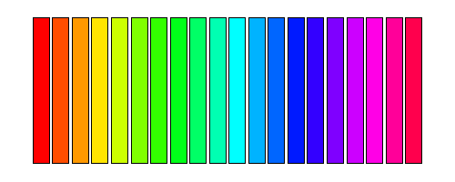
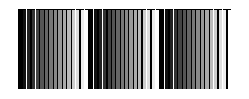
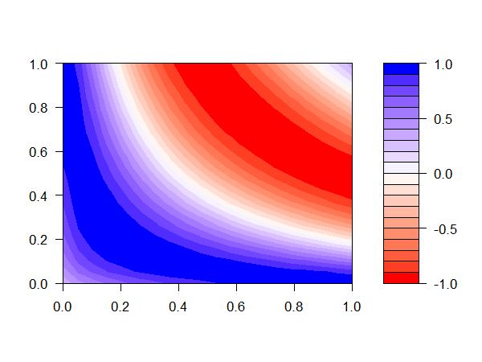
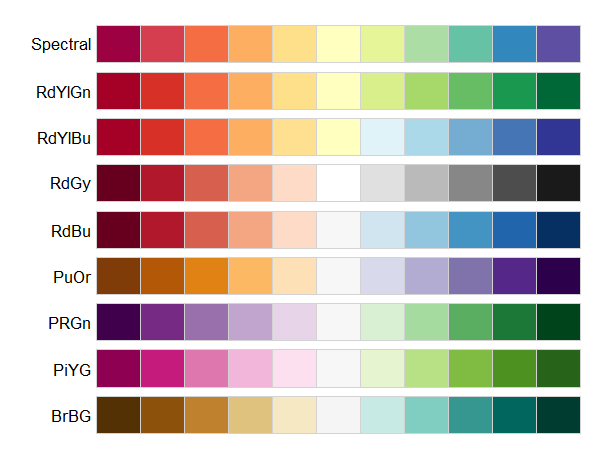
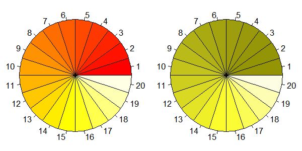
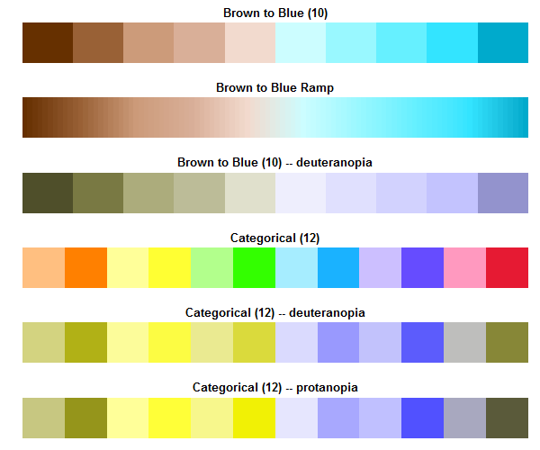

<!-- Set background color for slide 1 in libraries/frameworks/io2012/slidify.css -->

## Key ideas
* Color Spaces
  * RGB Additive Color Space
  * RGB Color Names
* R Color Basics
  * Color Definition
  * Palette Types and RColorBrewer
  * Points, Axes, Text, Lines, Legends, Background
* Color Tips
  * Image Processing
  * Color Deficiency/Blindness
  * Why don't screen colors match printout?
  * Presentations

---

## Color Spaces
* [RGB](http://en.wikipedia.org/wiki/RGB_color_space) Red-Green-Blue

* [HSV](http://en.wikipedia.org/wiki/HSL_and_HSV) Hue-Saturation-Value

* [HLS](http://en.wikipedia.org/wiki/HSL_and_HSV) Hue-Lightness-Saturation

* [LAB](http://en.wikipedia.org/wiki/Lab_color_space) coordinates in CIE LAB space

* R Package: [help(package=colorspace)](http://cran.r-project.org/web/packages/colorspace/colorspace.pdf)

[Why did you learn the wrong primary colors in elementary school?](http://www.greatreality.com/ColorPrimary.htm)

---

## RGB Additive Color Space


---

## RGB Additive Color Space
0.0 to 1.0, decimal 0 to 255, hexadecimal 00 to FF


```r
rgb(1,0,0)   # red
```

```
[1] "#FF0000"
```

```r
rgb(0,1,0)   # green
```

```
[1] "#00FF00"
```

```r
rgb(0,0,1)   # blue
```

```
[1] "#0000FF"
```


---

## RGB Additive Color Space

```r
rgb(1,0,1)   # magenta = red   + blue
```

```
[1] "#FF00FF"
```

```r
rgb(1,1,0)   # yellow  = red   + green
```

```
[1] "#FFFF00"
```

```r
rgb(0,1,1)   # cyan    = green + blue
```

```
[1] "#00FFFF"
```


---

## RGB Additive Color Space

```r
rgb(1,0,0)    # red
```

```
[1] "#FF0000"
```

```r
rgb(255,0,0, maxColorValue=255)
```

```
[1] "#FF0000"
```

```r
col2rgb(c("black", "red", "green", "blue", "yellow", "white"))
```

```
      [,1] [,2] [,3] [,4] [,5] [,6]
red      0  255    0    0  255  255
green    0    0  255    0  255  255
blue     0    0    0  255    0  255
```


---

## RGB Color Names:  `colors()`
Color names and RGB values also in file
C:\Program Files\R\R-3.0.2\etc\rgb.txt


```r
# colors() or colours()
length(colors())
```

```
[1] 657
```

```r
head(colors())
```

```
[1] "white"         "aliceblue"     "antiquewhite"  "antiquewhite1" "antiquewhite2" "antiquewhite3"
```

```r
tail(colours())
```

```
[1] "yellow"      "yellow1"     "yellow2"     "yellow3"     "yellow4"     "yellowgreen"
```


---

## RGB Color Names

```r
colors()[grep("red", colors())]   # colors with "red"
```

```
 [1] "darkred"         "indianred"       "indianred1"      "indianred2"      "indianred3"     
 [6] "indianred4"      "mediumvioletred" "orangered"       "orangered1"      "orangered2"     
[11] "orangered3"      "orangered4"      "palevioletred"   "palevioletred1"  "palevioletred2" 
[16] "palevioletred3"  "palevioletred4"  "red"             "red1"            "red2"           
[21] "red3"            "red4"            "violetred"       "violetred1"      "violetred2"     
[26] "violetred3"      "violetred4"     
```

```r
head(colors()[grep("blue", colors())], 25)  # 25 of 66 "blue" colors
```

```
 [1] "aliceblue"      "blue"           "blue1"          "blue2"          "blue3"         
 [6] "blue4"          "blueviolet"     "cadetblue"      "cadetblue1"     "cadetblue2"    
[11] "cadetblue3"     "cadetblue4"     "cornflowerblue" "darkblue"       "darkslateblue" 
[16] "deepskyblue"    "deepskyblue1"   "deepskyblue2"   "deepskyblue3"   "deepskyblue4"  
[21] "dodgerblue"     "dodgerblue1"    "dodgerblue2"    "dodgerblue3"    "dodgerblue4"   
```

---

## RGB Color Names
7-page Color Chart of colors()

[https://github.com/EarlGlynn/colorchart/raw/master/ColorChart.pdf](https://github.com/EarlGlynn/colorchart/raw/master/ColorChart.pdf)


Details showing how to create chart in R:  [Color Chart in R](https://github.com/EarlGlynn/colorchart/wiki/Color-Chart-in-R)

---

## RGB Color Names

__3D colors() Example__

From Example 6a in `?scatterplot3d`  help in `library(scatterplot3d)`
<div class="rimage center"></div>


---
## R Color Basics:  Color Definition

A color in R can be specified in three ways:

* color name

* hex constant #000000 through #FFFFFF  (a 24-bit color)

* index into palette, which is vector of color names and/or hex constants

---
## R Color Basics:  Default Palette


```r
palette()   # show default palette
```

```
[1] "black"   "red"     "green3"  "blue"    "cyan"    "magenta" "yellow"  "gray"   
```

```r
par(mar=c(1,1,1,1))  # Reduce margins
barplot(rep(1,8), yaxt="n", col=1:8)
```

<div class="rimage center"></div>


To use default palette if not currently the defined palette:

`barplot(rep(1,8), yaxt="n", col=palette("default"))`

---
## R Palette:  "Rainbow"


```r
N <- 20
palette(rainbow(N))   # Define N-color rainbow palette
palette()             # Show colors in current palette
```

```
 [1] "red"     "#FF4D00" "#FF9900" "#FFE500" "#CCFF00" "#80FF00" "#33FF00" "#00FF19" "#00FF66"
[10] "#00FFB2" "cyan"    "#00B3FF" "#0066FF" "#001AFF" "#3300FF" "#7F00FF" "#CC00FF" "#FF00E6"
[19] "#FF0099" "#FF004D"
```

```r
par(mar=c(1,1,1,1))   # Reduce margins
barplot(rep(1,N), yaxt="n", col=1:N)
```

<div class="rimage center"></div>


---
## R Palette:  Shades of Grey Palette

Function spelled either `grey()` or `gray()`


```r
N <- 16                           # N = Number of grey levels
0:(N-1) / (N-1)                   # vector with values from 0 to 1
```

```
 [1] 0.00000 0.06667 0.13333 0.20000 0.26667 0.33333 0.40000 0.46667 0.53333 0.60000 0.66667 0.73333
[13] 0.80000 0.86667 0.93333 1.00000
```

```r
palette(grey(0:(N-1) / (N-1)))    # Define N-shades of grey (256 is max)
palette()                         # Show colors in current palette
```

```
 [1] "black"   "#111111" "#222222" "gray20"  "#444444" "#555555" "gray40"  "#777777" "#888888"
[10] "gray60"  "#AAAAAA" "#BBBBBB" "gray80"  "#DDDDDD" "#EEEEEE" "white"  
```


---
## R Palette:  Shades of Grey Palette


```r
par(mar=c(1,1,1,1))                     # Reduce margins
barplot(rep(1,3*N), yaxt="n", col=1:N)  # Three cycles
```

<div class="rimage center"></div>


Plotting 3*N bars with palette of N shades of grey results in color recycling.
R recycles colors whenever there are more objects to plot than colors.

---

## R Palette:  Other N-Color Palettes

__heat.colors()__


```r
par(mar=rep(0,4))    # No margins
barplot(rep(1,16), yaxt="n", col=heat.colors(16))
```

<div class="rimage center"></div>


__cm.colors()__    *cyan-magenta*


```r
par(mar=rep(0,4))    # No margins
barplot(rep(1,16), yaxt="n", col=cm.colors(16))
```

<div class="rimage center"></div>


---
## R Palette:  Other N-Color Palettes

__topo.colors()__


```r
par(mar=rep(0,4))    # No margins
barplot(rep(1,16), yaxt="n", col=topo.colors(16))
```

<div class="rimage center"></div>


__terrain.colors()__


```r
par(mar=rep(0,4))    # No margins
barplot(rep(1,16), yaxt="n", col=terrain.colors(16))
```

<div class="rimage center"></div>


---

## R Palette Function:  colorRampPalette()

Use `colorRampPalette()` to define function that creates palette.


```r
z <- outer(1:20, 1:20, function(x,y) sin(sqrt(x*y)/3))
PaletteFunction <- colorRampPalette(c("red", "white", "blue"), space = "Lab")
filled.contour(z, col = PaletteFunction(20))
```

<div class="rimage center"></div>


---
## Palette Types

__Qualitative Palette__
* All colors have same perceptual weight/importance
* Typical application:  bar plot

__Sequential Palette__
* For coding numerical information in a range
* Typical application:  heat map

__Diverging Palette__
* Like sequential palette but middle neutral value between two extremes

Details:
* [Choosing Color Palettes for Statistical Graphics](http://epub.wu.ac.at/1404/1/document.pdf)
* [Choosing Colour palettes. Part I: Introduction](http://blog.ggplot2.org/post/23995319650/choosing-colour-palettes-part-i-introduction) (ggplot2 examples)

---
## R Palettes:  RColorBrewer Package


```r
library(RColorBrewer)
table(brewer.pal.info$category)
```

```

 div qual  seq 
   9    8   18 
```

```r
brewer.pal.info[brewer.pal.info$category == "qual",]
```

```
        maxcolors category
Accent          8     qual
Dark2           8     qual
Paired         12     qual
Pastel1         9     qual
Pastel2         8     qual
Set1            9     qual
Set2            8     qual
Set3           12     qual
```


---
## RColorBrewer: Qualitative Palettes


```r
par(mar=c(0,4,0,0))  # Smaller margins than default
display.brewer.all(type="qual")
```

<div class="rimage center"></div>


---
## RColorBrewer: Sequential Palettes


```r
par(mar=c(0,4,0,0))  # Smaller margins than default
display.brewer.all(type="seq")
```

<div class="rimage center"></div>


---
## RColorBrewer: Diverging Palettes


```r
par(mar=c(0,4,0,0))  # Smaller margins than default
display.brewer.all(type="div")
```

<div class="rimage center"></div>


---

## R Color Basics:  Object color

Many R objects can take on different colors:

* Points
* Lines
* Axes
* Text
* Legends
* Background


---

## R Color Basics:  Points


```r
palette()[1:5]   # First five elements of default palette
```

```
[1] "black"  "red"    "green3" "blue"   "cyan"  
```

```r
x <- -2:2
y <- x^2
plot(x,y, col=1:5, pch=CIRCLE<-16, cex=2)
```

<div class="rimage center"></div>

---

## R Color Basics:  Points

__Equivalent plot statements:__

assuming default palette

`plot(x,y, col=1:5, pch=CIRCLE<-16, cex=2)`

`plot(x,y, col=c("black", "red", "green3", "blue", "cyan"), pch=CIRCLE, cex=2)`

`plot(x,y, col=c("#000000", "#FF0000", "green3", 4, 5), pch=CIRCLE, cex=2)`

---

## R Color Basics:  Points, Axes, Text

<div class="rimage center"></div>


See code on next slide.

---
## R Color Basics:  Points, Axes, Text


```r
# Points, Title, Axis Labels
plot(0:10, 0:10, col=0:10, pch=CIRCLE<-16, axes=FALSE,
     main="Chart Title", col.main="blue", cex.main=2,
     xlab="X axis", ylab="Y axis", col.lab="blue", cex.lab=1.5)

# Margin Text
mtext("Bottom",  BOTTOM<-1, col="red")
mtext("Left",    LEFT<-2,   col="green")

# Axes
axis(BOTTOM, col="red",   col.axis="black", cex.axis=1.5)
axis(LEFT,   col="green", col.axis="green", at=2*0:5, labels=paste(20*0:5),
     las=AXIS_LABEL_HORIZONTAL<-1)
```


---
## R Color Basics:  Lines and Legends

<div class="rimage center"></div>


See code on next slide.

---
## R Color Basics:  Lines and Legends


```r
library(RColorBrewer)

Time <- 0:120  # minutes

Types  <- c("solid", "dotted", "dashed")
Colors <- brewer.pal(3, "Dark2")   # qualitative palette

Periods <- data.frame(Period1=cos(2*pi*Time/120),
                      Period2=cos(2*pi*Time/ 90),
                      Period3=cos(2*pi*Time/150))

matplot(Periods, type="l", lwd=3,
        main="Expression Vs. Time", cex.main=1.5,
        xlab="Time[min]", ylab="Expression",
        col=Colors, lty=Types)
legend("top", c("120 min period", "90 min period", "150 min period"),
       col=Colors, lty=Types, lwd=3)
```


---
## R Color Basics:  Background Color


```r
par(bg="wheat", mar=c(4,4,0,0))  # background color
x <- -2:2
y <- x^2
plot(x,y, col=1:5, pch=CIRCLE<-16, cex=2)
```

<div class="rimage center"></div>


* Useful when copying and pasting metafile to PowerPoint since default is "transparent"

---
## Color Tip:  Image Processing

* Bioconductor package EBImage is an image processing toolbox for R.
* Supports `colormode` of `Grayscale` or `Color`.
* `channel` function handles color space conversions.
* Color colormode images have red, green, blue and possiby alpha channels.


Segmentation of cells in *Introduction to EBImage* documentation.


---
## Color Tip:  Color Deficiency/Blindness

* About 1 in 12 have some sort of color deficiency.
* ~8% of men and ~0.5% of women are affected [according to Wikipedia](http://en.wikipedia.org/wiki/Color_blindness).


[Ishihara Color Blindess Tests from ishiharatest.blogspot.com](http://ishiharatest.blogspot.com/)

* What numbers do you see?  12 at the left.  29 or 70 at the right?
* [How the Color Deficient Person Sees the World](http://colorvisiontesting.com/what%20colorblind%20people%20see.htm)


---
## Color Deficiency/Blindness:  R dichromat package


```r
library(dichromat)
par(mfcol=c(1,2), mar=rep(0,4))
N <- 20
pie(rep(1,N), col=heat.colors(N))
pie(rep(1,N), col=dichromat(heat.colors(N)))
```

<div class="rimage center"></div>


`dichromat` function collapses red-green color distinctions to approximate the effect of the two common forms of red-green color blindness: protanopia and deuteranopia

---
## Color Deficiency/Blindness:  R dichromat package

<div class="rimage center"></div>


See code on next slide.

---
## Color Deficiency/Blindness:  R dichromat package


```r
library(dichromat)
par(mar=c(1,2,2,1))
layout(matrix(1:6,ncol=1))
image(1:10,1,matrix(1:10, ncol=1),
     col=colorschemes$BrowntoBlue.10,
     main="Brown to Blue (10)", axes=FALSE)
image(1:100,1,matrix(1:100 ,ncol=1),
     col=colorRampPalette(colorschemes$BrowntoBlue.10,space="Lab")(100),
     main="Brown to Blue Ramp", axes=FALSE)
...
image(1:12,1,matrix(1:12, ncol=1),col=colorschemes$Categorical.12,
     main="Categorical (12)", axes=FALSE)
image(1:12,1,matrix(1:12, ncol=1),
     col=dichromat(colorschemes$Categorical.12, "deutan"),
     main="Categorical (12) -- deuteranopia", axes=FALSE)
image(1:12,1,matrix(1:12,ncol=1),
     col=dichromat(colorschemes$Categorical.12, "protan"),
     main="Categorical (12) -- protanopia", axes=FALSE)
```


---
## Color Tip:  Why don't screen colors match printout?

* Every device has a gamut of colors that it can display.
* Color gamuts between devices often do not match.
  * How should a color be represented if it cannot be displayed on a device?
* Color conversions may not be perfect, e.g., RGB additive colors must be converted to CMYK (Cyan-Magenta-Yellow-Black) subtractive colors for printing.
* Paper/ink differences

---
## Color Tip:  Presentations/Graphics

* Avoid unnecessary use of color.
* Use bright colors with small graphics to make them stand out.
* Be consistent in use of color.
* Do NOT use color as only attribute to show difference. E.g., consider color and line type.

Also see:  [Public Speaking:  Cool Color Commentary](http://www.public-speaking.org/public-speaking-color-article.htm)

---

## Color Resources

* [Wheels, Pyramids, and Spinning Tops: The Scientific Approach to Color](http://www.lindahall.org/events_exhib/), Exhibit at Linda Hall Library through March 14

* [Choosing Color Palettes for Statistical Graphics](http://epub.wu.ac.at/1404/1/document.pdf), Wirtschaftsuniversität Wien
* [Color Chart in R](https://github.com/EarlGlynn/colorchart/wiki/Color-Chart-in-R)
* [Colour for Presentation Graphics](http://www.r-project.org/conferences/DSC-2003/Proceedings/Ihaka.pdf), Proceedings of 3rd International Workshop on Distributed Statistical Computing
* [Using Color in Information Display Graphics](http://colorusage.arc.nasa.gov/), NASA
* [Using RColorBrewer to Colour Your Figures in R](http://www.r-bloggers.com/r-using-rcolorbrewer-to-colour-your-figures-in-r/), R-bloggers
* [Why Should Engineers and Scientists be Worried About Color?](http://www.research.ibm.com/people/l/lloydt/color/color.HTM), IBM


